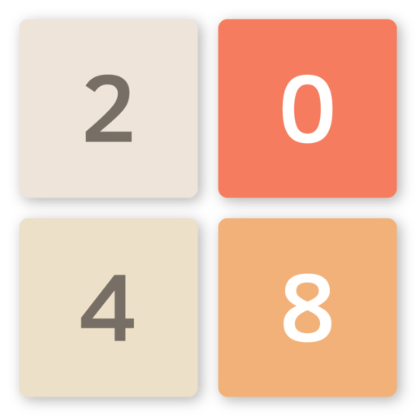

<h1 name="application_name">2048 Game</h1>
</img>
<h2 name="title">2048 is a simple sliding tile puzzle game</h2>
<h4 name="description">2048 is a single-player sliding tile puzzle video game written by Italian web developer Gabriele Cirulli and published on GitHub. The objective of the game is to slide numbered tiles on a grid to combine them to create a tile with the number 2048; however, one can continue to play the game after reaching the goal, creating tiles with larger numbers.</h4>
